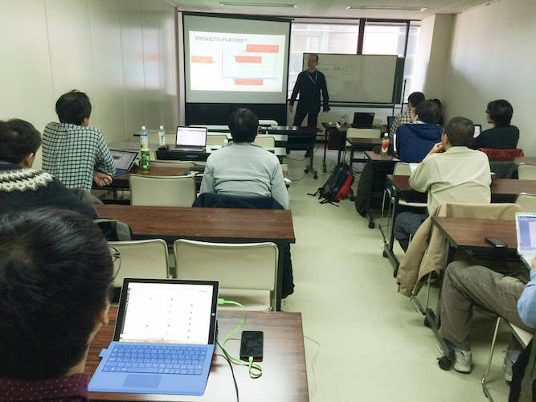
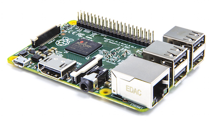
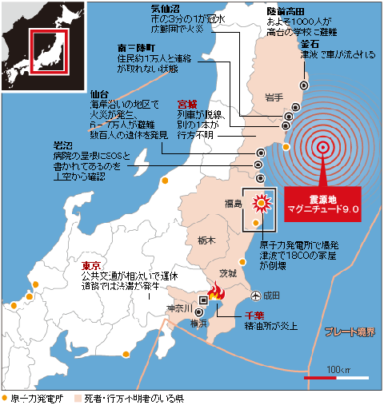
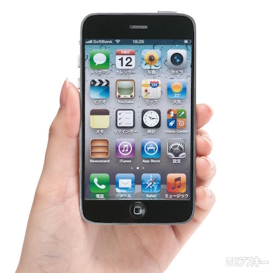
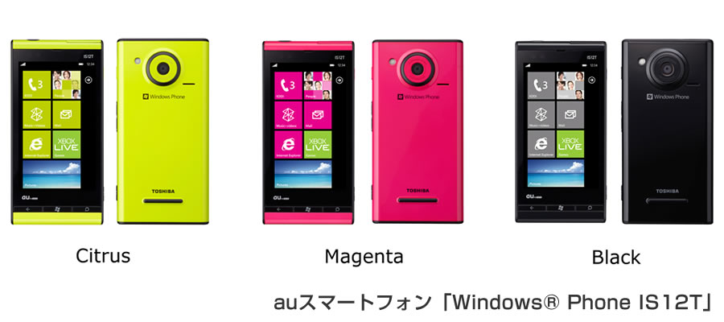
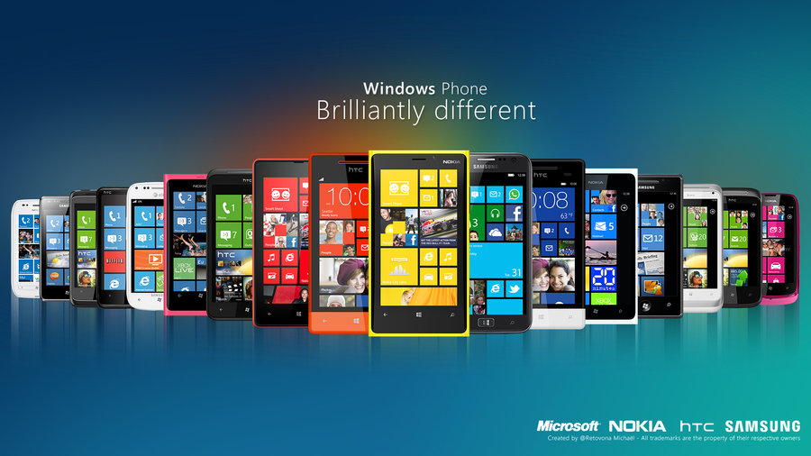

# コミュニティ紹介

---
## 「まどべんよっかいち」

---
# 概要

---
## 開催場所

四日市市

## ジャンル

IT系ノージャンル

---
# 沿革

---
## 2011年

東日本大震災

---
## 2011年

auからiPhone 4sが出た年

---
## 2011年

Windows Phone 発売

---
## 発足当時の名称

## 「Windows Phone勉強会」

「今年9月から日本でも販売が開始されたWindows Phoneについて勉強する会です。」

---
## 開催

## 2011年

第1回

## 2012年

第2回、第3回、第4回

---
## Windows Phone

---
## しかし日本ではまったく発売されず

---
## 2012年

Windows 8 発売

---
## 名称変更

第4回から「まどべんよっかいち」に変更

「2012年10月にWindows 8が発売になり、またWindows Phone 8が発表されました・・・これらについて、勉強できればと思います。」

---
## 開催

## 2013年

第5回、第6回、第7回

## 2014年

第8回、第9回、第10回

## 年3回のペース

---
## 内容変更

第10回から「対象はIT系であれば問いません」

---

---
## 次回

2014年5〜6月開催を予定してます

## どうぞよろしくお願いします